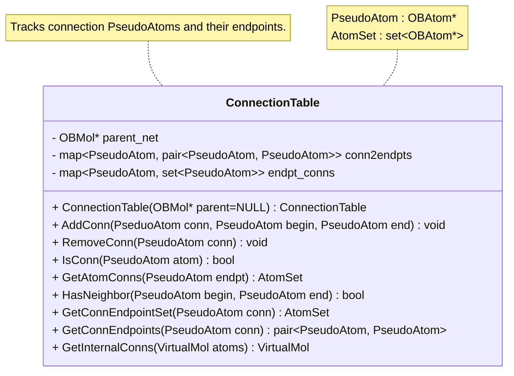

# ConnectionTable

## Diagram

```mermaid
classDiagram
    note for ConnectionTable "Tracks connection PseudoAtoms and their endpoints."
    note for ConnectionTable "PseudoAtom : OBAtom#42;
    AtomSet : set&lt;OBAtom#42;>"
    class ConnectionTable {
        - OBMol#42; parent_net
        - map&lt;PseudoAtom, pair&lt;PseudoAtom, PseudoAtom>> conn2endpts
        - map&lt;PseudoAtom, set&lt;PseudoAtom>> endpt_conns
        + ConnectionTable(OBMol#42; parent=NULL) ConnectionTable
        + AddConn(PseduoAtom conn, PseudoAtom begin, PseudoAtom end) void
        + RemoveConn(PseudoAtom conn) void
        + IsConn(PseudoAtom atom) bool
        + GetAtomConns(PseudoAtom endpt) AtomSet
        + HasNeighbor(PseudoAtom begin, PseudoAtom end) bool
        + GetConnEndpointSet(PseudoAtom conn) AtomSet
        + GetConnEndpoints(PseudoAtom conn) pair&lt;PseudoAtom, PseudoAtom>
        + GetInternalConns(VirtualMol atoms) VirtualMol
    }
```
