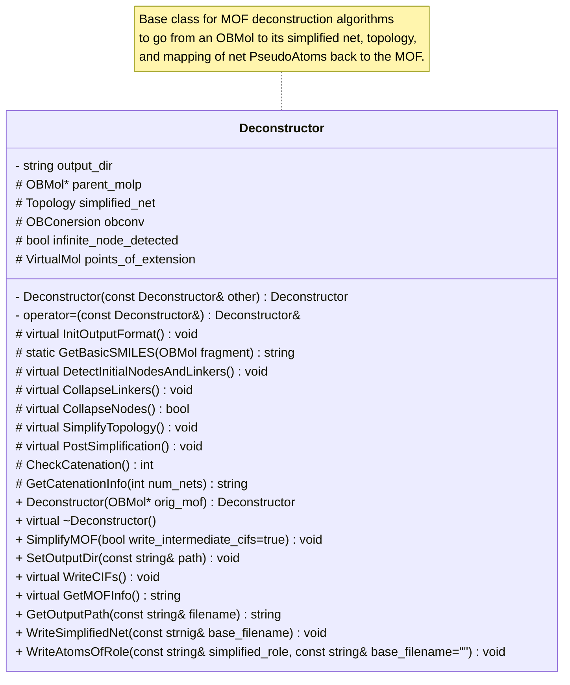

# Deconstructor

## Diagram

```mermaid
classDiagram
    note for Deconstructor "Base class for MOF deconstruction algorithms
    to go from an OBMol to its simplified net, topology,
    and mapping of net PseudoAtoms back to the MOF."
    class Deconstructor {
        - string output_dir
        - Deconstructor(const Deconstructor& other) Deconstructor
        - operator=(const Deconstructor&) Deconstructor&
        # OBMol#42; parent_molp
        # Topology simplified_net
        # OBConersion obconv
        # bool infinite_node_detected
        # VirtualMol points_of_extension
        # virtual InitOutputFormat() void
        # static GetBasicSMILES(OBMol fragment) string
        # virtual DetectInitialNodesAndLinkers() void
        # virtual CollapseLinkers() void
        # virtual CollapseNodes() bool
        # virtual SimplifyTopology() void
        # virtual PostSimplification() void
        # CheckCatenation() int
        # GetCatenationInfo(int num_nets) string
        + Deconstructor(OBMol#42; orig_mof) Deconstructor
        + virtual ~Deconstructor()
        + SimplifyMOF(bool write_intermediate_cifs=true) void
        + SetOutputDir(const string& path) void
        + virtual WriteCIFs() void
        + virtual GetMOFInfo() string
        + GetOutputPath(const string& filename) string
        + WriteSimplifiedNet(const strnig& base_filename) void
        + WriteAtomsOfRole(const string& simplified_role, const string& base_filename="") void
    }
```
