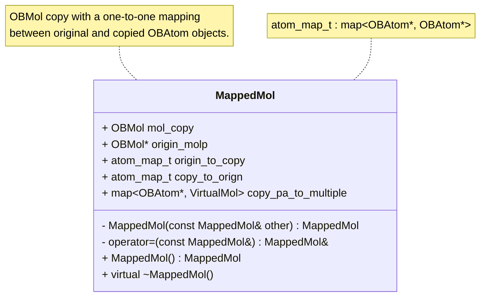

# MappedMol

## Diagram

```mermaid
classDiagram
    note for MappedMol "OBMol copy with a one-to-one mapping
    between original and copied OBAtom objects."
    note for MappedMol "atom_map_t : map&lt;OBAtom#42;, OBAtom#42;>"
    class MappedMol {
        - MappedMol(const MappedMol& other) MappedMol
        - operator=(const MappedMol&) MappedMol&
        + OBMol mol_copy
        + OBMol#42; origin_molp
        + atom_map_t origin_to_copy
        + atom_map_t copy_to_orign
        + map&lt;OBAtom#42;, VirtualMol> copy_pa_to_multiple
        + MappedMol() MappedMol
        + virtual ~MappedMol()
    }
```
