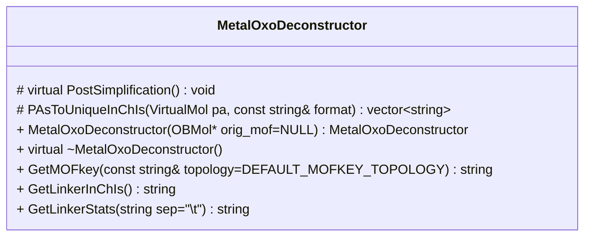

# MetalOxoDeconstructor

## Diagram

```mermaid
classDiagram
    class MetalOxoDeconstructor {
        # virtual PostSimplification() void
        # PAsToUniqueInChIs(VirtualMol pa, const string& format) vector&lt;string>
        + MetalOxoDeconstructor(OBMol#42; orig_mof=NULL) MetalOxoDeconstructor
        + virtual ~MetalOxoDeconstructor()
        + GetMOFkey(const string& topology=DEFAULT_MOFKEY_TOPOLOGY) string
        + GetLinkerInChIs() string
        + GetLinkerStats(string sep="\t") string
    }
```
