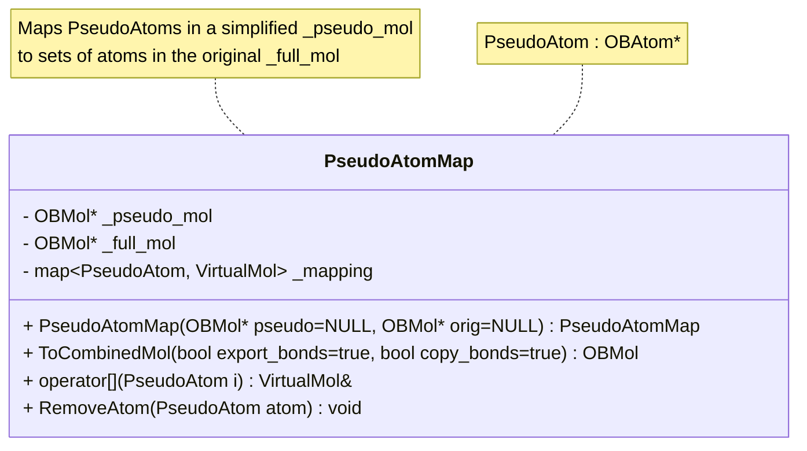

# PseudoAtomMap

## Diagram

```mermaid
classDiagram
    note for PseudoAtomMap "Maps PseudoAtoms in a simplified _pseudo_mol
    to sets of atoms in the original _full_mol"
    note for PseudoAtomMap "PseudoAtom : OBAtom#42;"
    class PseudoAtomMap {
        - OBMol#42; _pseudo_mol
        - OBMol#42; _full_mol
        - map&lt;PseudoAtom, VirtualMol> _mapping
        + PseudoAtomMap(OBMol#42; pseudo=NULL, OBMol#42; orig=NULL) PseudoAtomMap
        + ToCombinedMol(bool export_bonds=true, bool copy_bonds=true) OBMol
        + operator[](PseudoAtom i) VirtualMol&
        + RemoveAtom(PseudoAtom atom) void
    }
```
