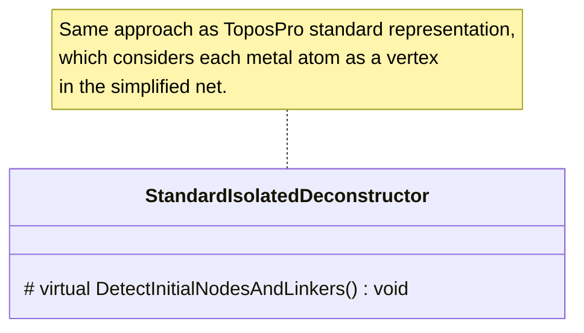

# StandardIsolatedDeconstructor

## Diagram

```mermaid
classDiagram
    note for StandardIsolatedDeconstructor "Same approach as ToposPro standard representation,
    which considers each metal atom as a vertex
    in the simplified net."
    class StandardIsolatedDeconstructor {
        # virtual DetectInitialNodesAndLinkers() void
    }
```
