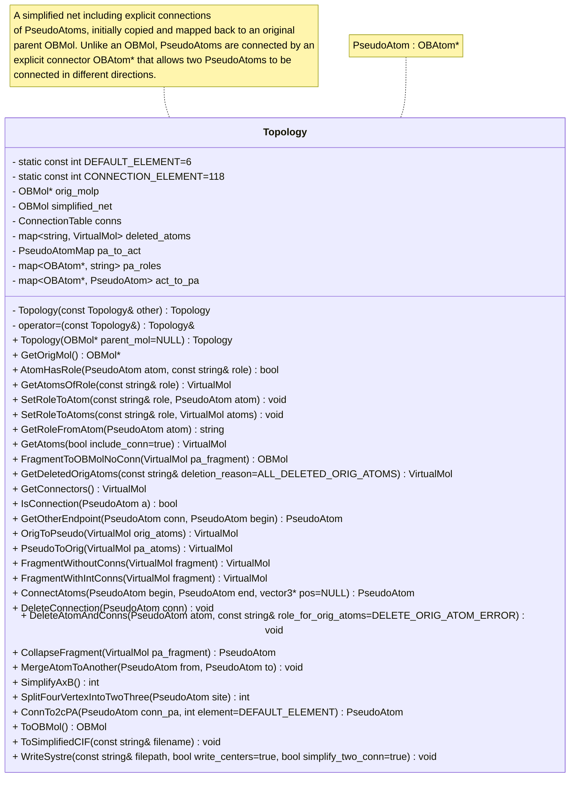

# Topology

## Diagram

```mermaid
classDiagram
    note for Topology "A simplified net including explicit connections
    of PseudoAtoms, initially copied and mapped back to an original
    parent OBMol. Unlike an OBMol, PseudoAtoms are connected by an 
    explicit connector OBAtom#42; that allows two PseudoAtoms to be 
    connected in different directions."
    note for Topology "PseudoAtom : OBAtom#42;"
    class Topology {
        - static const int DEFAULT_ELEMENT=6
        - static const int CONNECTION_ELEMENT=118
        - OBMol#42; orig_molp
        - OBMol simplified_net
        - ConnectionTable conns
        - map&lt;string, VirtualMol> deleted_atoms
        - PseudoAtomMap pa_to_act
        - map&lt;OBAtom#42;, string> pa_roles
        - map&lt;OBAtom#42;, PseudoAtom> act_to_pa
        - Topology(const Topology& other) Topology
        - operator=(const Topology&) Topology&
        + Topology(OBMol#42; parent_mol=NULL) Topology
        + GetOrigMol() OBMol#42;
        + AtomHasRole(PseudoAtom atom, const string& role) bool
        + GetAtomsOfRole(const string& role) VirtualMol
        + SetRoleToAtom(const string& role, PseudoAtom atom) void
        + SetRoleToAtoms(const string& role, VirtualMol atoms) void
        + GetRoleFromAtom(PseudoAtom atom) string
        + GetAtoms(bool include_conn=true) VirtualMol
        + FragmentToOBMolNoConn(VirtualMol pa_fragment) OBMol
        + GetDeletedOrigAtoms(const string& deletion_reason=ALL_DELETED_ORIG_ATOMS) VirtualMol
        + GetConnectors() VirtualMol
        + IsConnection(PseudoAtom a) bool
        + GetOtherEndpoint(PseudoAtom conn, PseudoAtom begin) PseudoAtom
        + OrigToPseudo(VirtualMol orig_atoms) VirtualMol
        + PseudoToOrig(VirtualMol pa_atoms) VirtualMol
        + FragmentWithoutConns(VirtualMol fragment) VirtualMol
        + FragmentWithIntConns(VirtualMol fragment) VirtualMol
        + ConnectAtoms(PseudoAtom begin, PseudoAtom end, vector3#42; pos=NULL) PseudoAtom
        + DeleteConnection(PseudoAtom conn) void
        + DeleteAtomAndConns(PseudoAtom atom, const string& role_for_orig_atoms=DELETE_ORIG_ATOM_ERROR) void
        + CollapseFragment(VirtualMol pa_fragment) PseudoAtom
        + MergeAtomToAnother(PseudoAtom from, PseudoAtom to) void
        + SimplifyAxB() int
        + SplitFourVertexIntoTwoThree(PseudoAtom site) int
        + ConnTo2cPA(PseudoAtom conn_pa, int element=DEFAULT_ELEMENT) PseudoAtom
        + ToOBMol() OBMol
        + ToSimplifiedCIF(const string& filename) void
        + WriteSystre(const string& filepath, bool write_centers=true, bool simplify_two_conn=true) void
    }
```
