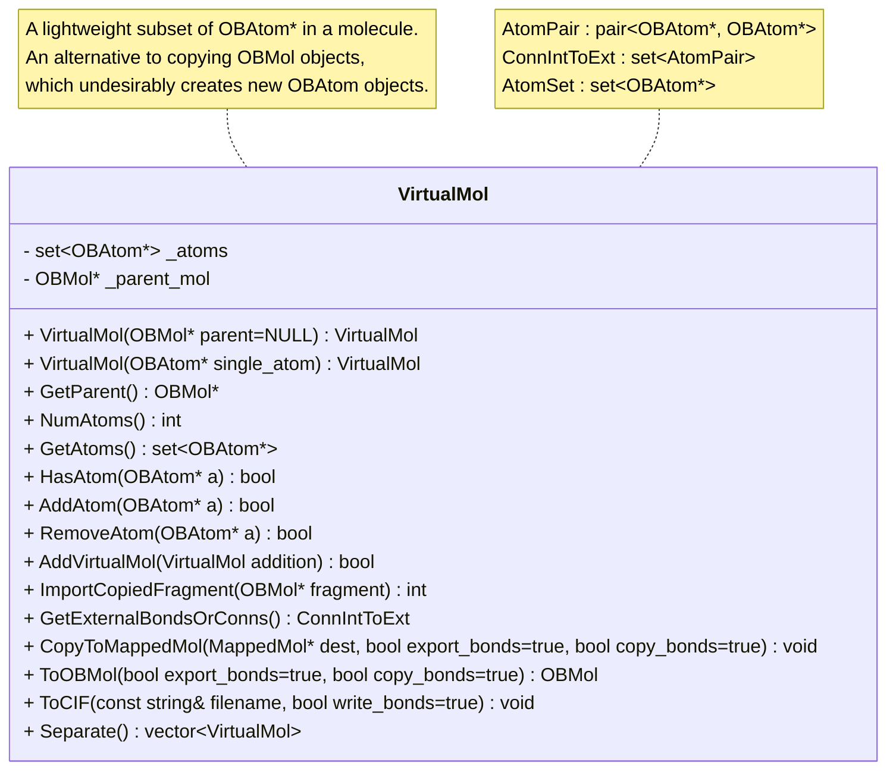

# VirtualMol

## Diagram

```mermaid
classDiagram
    note for VirtualMol "A lightweight subset of OBAtom#42; in a molecule.
    An alternative to copying OBMol objects, 
    which undesirably creates new OBAtom objects."
    note for VirtualMol "AtomPair : pair&lt;OBAtom#42;, OBAtom#42;>
    ConnIntToExt : set&lt;AtomPair>
    AtomSet : set&lt;OBAtom#42;>"
    class VirtualMol {
        - set&lt;OBAtom#42;> _atoms
        - OBMol#42; _parent_mol
        + VirtualMol(OBMol#42; parent=NULL) VirtualMol
        + VirtualMol(OBAtom#42; single_atom) VirtualMol
        + GetParent() OBMol#42;
        + NumAtoms() int
        + GetAtoms() set&lt;OBAtom#42;>
        + HasAtom(OBAtom#42; a) bool
        + AddAtom(OBAtom#42; a) bool
        + RemoveAtom(OBAtom#42; a) bool
        + AddVirtualMol(VirtualMol addition) bool
        + ImportCopiedFragment(OBMol#42; fragment) int
        + GetExternalBondsOrConns() ConnIntToExt
        + CopyToMappedMol(MappedMol#42; dest, bool export_bonds=true, bool copy_bonds=true) void
        + ToOBMol(bool export_bonds=true, bool copy_bonds=true) OBMol
        + ToCIF(const string& filename, bool write_bonds=true) void
        + Separate() vector&lt;VirtualMol>
    }
```
